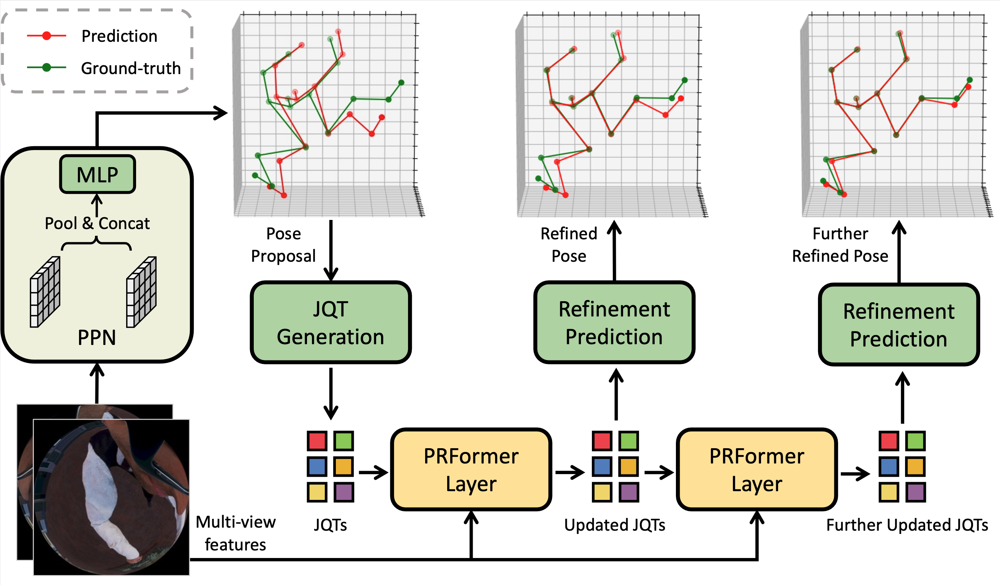

# EgoPoseFormer
<p align="center">

</p>

This repository contains the official PyTorch implementation of our paper:

[EgoPoseFormer: A Simple Baseline for Egocentric 3D Human Pose Estimation, *Chenhongyi Yang*, *Anastasia Tkach*, *Shreyas Hampali*, *Linguang Zhang*, *Elliot J. Crowley*, *Cem Keskin*. ECCV 2024.](https://www.ecva.net/papers/eccv_2024/papers_ECCV/papers/07241.pdf)


## Usage

### Environment Setup
```shell
conda create -n egoposeformer python=3.10 -y
source activate egoposeformer

pip install torch==1.13.1+cu116 torchvision==0.14.1+cu116 -f https://download.pytorch.org/whl/torch_stable.html
pip install pytorch-lightning==2.1.0 
pip install numba==0.56.4
pip install numpy==1.23.5
pip install mmcv-full==1.6.0

git clone https://github.com/ChenhongyiYang/egoposeformer.git
cd EgoPoseFormer
pip install -e .
```

### Dataset Setup
We provide support for our main dataset [UnrealEgo](https://github.com/hiroyasuakada/UnrealEgo). Please refer to its [official instruction](https://4dqv.mpi-inf.mpg.de/UnrealEgo/) to download the dataset. Specifically, you only need to download the [UnrealEgoData_impl](https://drive.google.com/drive/folders/12SIG2yxQpRVwgY5ZPo-8AAn5L8n84XMc) split. You also need to download [pelvis_pos.pkl](https://drive.google.com/file/d/11ADVL-DxWYGnLy0V9ogBT1RGkqe4CRCn/view?usp=sharing), which is extracted from the UnrealEgo meta data, for computing 3D to 2D projection.  The file structures should be:
```
EgoPoseFormer
|-- configs
|-- pose_estimation
|-- ...
|-- data
|   |-- unrealego
|   |   |-- unrealego_impl
|   |   |    |-- ArchVisInterior_ArchVis_RT
|   |   |    |-- ...
|   |   |-- pelvis_pos.pkl
|   |   |-- train.txt
|   |   |-- validation.txt
|   |   |-- test.txt  
```

### Training and Testing
You can easily run an experiments using the following commands:
```shell
# train
python run.py fit --config $CONFIG
# test
python run.py test --config $CONFIG --ckpt_path $PATH
```
For example, you can run a full UnrealEgo experiment by:
```shell
# 2D heatmap pre-training
python run.py fit --config ./configs/unrealego_r18_heatmap.yaml

# training EgoPoseFormer
# Note: You will need to put the pre-trained encoder path to 
#       the `encoder_pretrained` entry in the config file
python run.py fit --config ./configs/unrealego_r18_pose3d.yaml

# testing EgoPoseFormer
python run.py test --config ./configs/unrealego_r18_pose3d.yaml --ckpt_path path/to/ckpt
```

## Results
| Backbone  | MPJPE | PA-MPJPE |                                                                                         Config                                                                                          | Weights  |
|:---------:|:-----:|:--------:|:---------------------------------------------------------------------------------------------------------------------------------------------------------------------------------------:|:--------:|
| ResNet-18 | 34.5  |   33.4   | [Pre-train](https://github.com/ChenhongyiYang/egoposeformer/blob/main/configs/unrealego_r18_heatmap.yaml) /  [Pose](https://github.com/ChenhongyiYang/egoposeformer/blob/main/configs/unrealego_r18_pose3d.yaml) | [Link](https://drive.google.com/drive/folders/1eRWyj1-v5hO4RcKHOpJTwc-XSKsivIsn?usp=drive_link) |

Note: We numbers are measured using newly trained models, so they are slightly different from the numbers reported in the paper.

## Citation

```
@inproceedings{yang2024egoposeformer,
  title={EgoPoseFormer: A Simple Baseline for Stereo Egocentric 3D Human Pose Estimation},
  author={Yang, Chenhongyi and Tkach, Anastasia and Hampali, Shreyas and Zhang, Linguang and Crowley, Elliot J and Keskin, Cem},
  journal={European conference on computer vision},
  year={2024},
  organization={Springer}
}
```

## Acknowledgement
This codebase is partially inspired by the [UnrealEgo](https://github.com/hiroyasuakada/UnrealEgo) implementation. 
